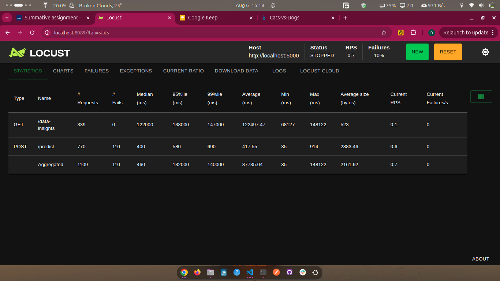

# End-to-End Machine Learning Pipeline: Image Classification

## Video Demo

A short video demonstration of the application in action:

[Watch the Demo on YouTube](https://youtu.be/q68DtV-E5EM)

## Live Demo

You can access the live deployed version of this application here:

[Live Application URL](https://ml-pipeline-summative-three.vercel.app/)

---

This project provides a complete end-to-end machine learning pipeline for image classification, featuring a Python Flask API backend for model serving and retraining, and a Next.js frontend for user interaction and data visualization.

## Table of Contents

*   [Features](#features)
*   [Technologies Used](#technologies-used)
*   [Project Structure](#project-structure)
*   [Setup Instructions](#setup-instructions)
    *   [Backend Setup (Python Flask)](#backend-setup-python-flask)
    *   [Frontend Setup (Next.js)](#frontend-setup-nextjs)
*   [Usage](#usage)
    *   [Image Prediction](#image-prediction)
    *   [Model Retraining](#model-retraining)
    *   [Data Visualizations & Interpretations](#data-visualizations--interpretations)
*   [Results from Flood Request Simulation](#results-from-flood-request-simulation)
*   [Deployment on Vercel](#deployment-on-vercel)

## Features

*   **Image Prediction:** Upload an image and get real-time predictions from the trained ML model.
*   **Model Retraining:** Upload new datasets (in ZIP format) to trigger on-demand model retraining.
*   **Data Insights:** Visualize class distribution, sample images, and image dimensions of your training data.
*   **Scalable Architecture:** Separated frontend and backend for better maintainability and scalability.
*   **Vercel Deployment Ready:** Configured for seamless deployment on Vercel as a monorepo.

## Technologies Used

*   **Backend:**
    *   Python 3.x
    *   Flask: Web framework for the API.
    *   TensorFlow / Keras: For building, training, and serving the ML model.
    *   Pillow (PIL): For image processing.
    *   Numpy: For numerical operations.
    *   Scikit-learn: For data splitting.
    *   Flask-CORS: For handling Cross-Origin Resource Sharing.
    *   Kagglehub: For dataset download.
*   **Frontend:**
    *   Next.js (React Framework): For building the user interface.
    *   TypeScript: For type-safe JavaScript.
    *   Tailwind CSS: For styling.
    *   shadcn/ui: UI components.
    *   Recharts: For data visualization (charts).
    *   Lucide React: Icons.
*   **Deployment:**
    *   Vercel: Hosting platform for both frontend and backend.
    *   Git LFS: For managing large model files.

## Project Structure

```
ML-Pipeline-Summative/
│
├── README.md                            ← Project overview and documentation
├── app/                                 ← Next.js frontend (App Router)
│   └── page.tsx                         ← Main dashboard page
├── components/                          ← Reusable React components (e.g., shadcn/ui)
├── data/                                ← Organized image data (training/testing)
│   ├── train/
│   │   ├── cats/
│   │   └── dogs/
│   └── test/
│       ├── cats/
│       └── dogs/
├── models/                              ← Saved ML model (.h5)
│   └── image_classifier_model.h5
├── notebook/
│   └── image_classification_pipeline.ipynb ← Jupyter notebook for training
├── public/                              ← Static assets for frontend (e.g., locust results)
│   └── images/
│       └── locust-results.png
├── scripts/                             ← Dataset preparation utilities
│   ├── setup_data.py                    ← Download and organize dataset
│   └── check_data_contents.py          ← Check folder structure and stats
├── src/                                 ← Python Flask backend
│   ├── api.py                           ← Flask API endpoints
│   ├── model.py                         ← Model definition and training
│   ├── prediction.py                    ← Prediction logic
│   └── preprocessing.py                 ← Image preprocessing utilities
├── .gitattributes                       ← Git LFS configuration
├── locustfile.py                        ← Locust load test file (flood simulation)
├── next.config.mjs                      ← Next.js build config
├── postcss.config.js                    ← PostCSS (Tailwind CSS config)
├── package.json                         ← Frontend dependencies
├── pnpm-lock.yaml                       ← pnpm lockfile
├── requirements.txt                     ← Python dependencies
├── tailwind.config.ts                   ← Tailwind CSS configuration
├── tsconfig.json                        ← TypeScript configuration
└── vercel.json                          ← Vercel deployment configuration
```

## Setup Instructions

Follow these steps to set up and run the project locally.

### Backend Setup (Python Flask)

1.  **Clone the repository:**
    \`\`\`bash
    git clone <your-repository-url>
    cd <your-repository-name>
    \`\`\`

2.  **Create a Python Virtual Environment (recommended):**
    \`\`\`bash
    python -m venv venv
    source venv/bin/activate # On Windows: venv\Scripts\activate
    \`\`\`

3.  **Install Python Dependencies:**
    \`\`\`bash
    pip install -r requirements.txt
    \`\`\`

4.  **Download and Organize Data:**
    Run the `setup_data.py` script to download the Cats vs. Dogs dataset from Kaggle and organize it into the `data/train` and `data/test` directories. This is crucial for both training and data insights.
    \`\`\`bash
    python scripts/setup_data.py
    \`\`\`
    *   **Note:** This script will create `data/train/cats`, `data/train/dogs`, `data/test/cats`, and `data/test/dogs` directories and populate them with images.

5.  **Train the Machine Learning Model:**
    Open and run the Jupyter Notebook to train the model and save it. This will create the `models/image_classifier_model.h5` file.
    \`\`\`bash
    jupyter notebook notebook/image_classification_pipeline.ipynb
    \`\`\`
    *   **Important:** Ensure all cells in the notebook are run successfully. The `MODEL_PATH` in `src/model.py` and `src/prediction.py` points to `../models/image_classifier_model.h5`.

6.  **Start the Flask API Server:**
    Navigate to the project root and run the Flask application.
    \`\`\`bash
    python src/api.py
    \`\`\`
    The API will typically run on `http://localhost:5000`.

### Frontend Setup (Next.js)

1.  **Install Node.js Dependencies:**
    Navigate to the project root and install the frontend dependencies.
    \`\`\`bash
    pnpm install # or npm install
    \`\`\`

2.  **Start the Next.js Development Server:**
    \`\`\`bash
    pnpm dev # or npm run dev
    \`\`\`
    The frontend will typically run on `http://localhost:3000`.

## Usage

Once both the Flask API and Next.js frontend are running, open your browser to `http://localhost:3000`.

### Image Prediction

1.  In the "Model Prediction" section, click "Upload Image".
2.  Select an image file (e.g., a cat or dog image).
3.  Click the "Predict" button.
4.  The prediction result (predicted class and confidence) will be displayed.

### Model Retraining

1.  Prepare a new dataset as a ZIP file. The ZIP file should contain subdirectories for each class (e.g., `new_data.zip` containing `new_data/class_a/image1.jpg`, `new_data/class_b/image2.png`).
2.  In the "Model Retraining" section, click "Upload New Data (ZIP)".
3.  Select your prepared ZIP file.
4.  Click "Trigger Retrain".
5.  The API will extract the data, retrain the model, and update the insights.

### Data Visualizations & Interpretations

This section automatically fetches and displays insights from your `data/train` directory:

*   **Class Distribution:** A bar chart showing the number of images per class.
*   **Sample Images per Class:** Displays a few sample images from each class.
*   **Image Dimensions/Resolution:** Provides min, max, and average dimensions of images.

Ensure `setup_data.py` has been run to populate the `data` directory for these visualizations to work.

## Results from Flood Request Simulation

This section presents the results of a load test performed using Locust.io on the API endpoints.



**Interpretation of Results:**

The simulation was run with **20 users**, generating a total of **1,109 requests** (RPS: **0.7**) and a **10% failure rate**.

- **GET `/data-insights`:**
  - ✅ **0 failures**
  - 🕒 Median response time: **122s**
  - 📈 Indicates this endpoint is heavy—likely due to extensive image processing.

- **POST `/predict`:**
  - ⚠️ **110 failures out of 770 requests** (~14.3% failure rate)
  - ⏱️ Median response time: **400ms**, average: **417ms**
  - 🔍 Suggests the model serving pipeline breaks under load—likely due to concurrent access or image issues.

**Summary:**

- Optimize `/data-insights` for performance using caching or pre-computed stats.
- Improve robustness of `/predict` endpoint by:
  - Keeping the model loaded in memory.
  - Validating images earlier.
  - Increasing server capacity if needed.

**Key Takeaways:**

*   The `/data-insights` endpoint needs significant optimization to reduce its extremely high response times.
*   The `/predict` endpoint, despite better latency, has a critical failure rate that needs immediate investigation and resolution to ensure reliability.

## Deployment on Vercel

This project is configured for deployment on Vercel as a monorepo, handling both the Next.js frontend and the Flask API backend.

1.  **`vercel.json`:** The `vercel.json` file in the project root configures Vercel to build the Next.js app and deploy the Flask API as a serverless function. It also sets up routing to direct `/api/*` requests to the Flask backend.
2.  **Git LFS:** Ensure your `.h5` model file is tracked by Git LFS.
    *   Add `*.h5 filter=lfs diff=lfs merge=lfs -text` to your `.gitattributes` file.
    *   If the model file was already committed without LFS, you'll need to migrate it:
        \`\`\`bash
        git lfs track "*.h5"
        git add .gitattributes
        git rm --cached models/image_classifier_model.h5 # Replace with your actual model path
        git add models/image_classifier_model.h5
        git commit -m "Migrate .h5 model to Git LFS"
        git push origin main # Or your branch name
        \`\`\`
    *   This ensures large files are handled correctly during deployment, avoiding "Size of uploaded file exceeds 300MB" errors.
